# 개발 환경

| 대상          | 버전                                                                |
| ------------- | ------------------------------------------------------------------- |
| OS            | Windows 10 24H2(Desktop), MacOS Sequoia 15.5(24F74)(MacBook M2 Air) |
| STM32CubeMX   | 6.18.1                                                              |
| STM32CubeProg | 2.23.0                                                              |
| 보드          | FK743M2-IIT6                                                        |
| 펌웨어        | V24J47M34                                                           |

# 참고한 자료

- MCU 데이터 시트

  [rm0433-stm32h742-stm32h743753-and-stm32h750-value-line-advanced-armbased-32bit-mcus-stmicroelectronics.pdf](https://www.st.com/resource/en/reference_manual/rm0433-stm32h742-stm32h743753-and-stm32h750-value-line-advanced-armbased-32bit-mcus-stmicroelectronics.pdf)

- SDRAM 데이터 시트

  [42-45S83200J-16160J.pdf](https://www.issi.com/WW/pdf/42-45S83200J-16160J.pdf)

- 개발 보드 핀아웃

  [STM32H743_FANKE/FK743M2-IIT6(排针版)原理图.pdf at main · nr-electronics/STM32H743_FANKE](<https://github.com/nr-electronics/STM32H743_FANKE/blob/main/FK743M2-IIT6(%E6%8E%92%E9%92%88%E7%89%88)%E5%8E%9F%E7%90%86%E5%9B%BE.pdf>)

# SDRAM

동기식(Synchronous) DRAM(이하 램)이다. 램도 종류가 여러 개 있는데 그중에서도 동기 방식으로 동작하는 램이다.

> [SDRAM이란 무엇인가? | CORSAIR](https://www.corsair.com/kr/ko/explorer/glossary/what-is-sdram/)

램의 구조는 다음과 같다.

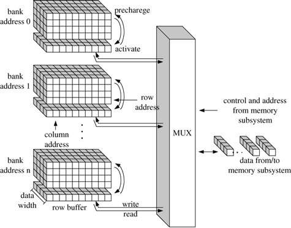

하나의 램은 사진과 같이 여러 개의 Bank로 나뉘어져 있다. 각 뱅크에는 Cell들이 있는데, 이 Cell들에 데이터를 쓰거나 읽을 수 있다. Cell에 접근하려면 주소가 필요한데, 행 번호와 열 번호를 조합한 주소를 사용한다.

## 램의 동작 방식

행 번호와 열 번호를 통해 Cell에 접근하게 되면 램 내부에서 일어나는 동작 방식은 다음과 같다.

1. 행 번호에 위치한 모든 Cell을 ACTIVATE한다. 이 명령은 해당 행에 있는 모든 데이터를 Sense Amplifier(또는 Row Buffer)로 복사한다.
2. 복사한 행의 데이터들중 열 번호에 위치한 데이터를 읽는다.
3. 데이터를 읽었으므로 다른 행을 읽기 위해서 현재 행을 PRECHARGE한다.
4. DRAM 구조 상 방전을 방지하기 위해 주기적으로 AUTO REFRESH를 한다.

## 지연 시간

각 작업에는 약간의 지연 시간이 있다.

- 행 데이터를 읽어오는 데 걸리는 지연 시간 : $t_{RCD}$ (Row to Column Delay)
- 복사한 행 데이터 중 읽으려는 데이터를 읽는 데 걸리는 지연 시간 : CAS Latency
- PRECHARGE에 걸리는 지연 시간 : $t_{RP}$

## Bank를 나눈 이유

각 단계를 수행하면서 약간의 지연 시간이 필연적으로 존재하기 때문에 그 지연 시간동안 다른 작업을 처리할 수 있도록 Bank가 나뉘어 있다. 한 Bank에서 작업을 처리하는 동안 다른 Bank에서 작업을 처리한다면 전체적인 IO 성능이 상승한다.

# FMC

Flexible Memory Controller의 약자다. 동기식/비동기식 램, NAND 플래시 메모리 등 여러 메모리를 다룰 수 있는 페리퍼럴이다. AXI 버스에서 발생한 트랜잭션을 외부 메모리 장치가 사용하는 프로토콜로 변환해준다. 이 과정에서 외부 메모리 장치가 사용하는 접근 타이밍을 만족하도록 제어한다.

# FK743M2-IIT6 개발 보드 설명

이 개발 보드를 구입한 이유는 이렇다. 실시간 오디오 신호처리를 하려면 메모리가 필요한데, MCU에 내장된 SRAM은 크기가 너무 작아서 활용하기 어려웠다. 그래서 외장 메모리가 탑재된 보드를 찾아보게 되었고, 보통 모듈을 구입할 때 알리 익스프레스를 이용했기 때문에 이곳에서 구매 가능한 보드 중에는 FK743 계열이 유일했다. 기존에 사용하던 MCU가 H743계열이므로, 가능한 이 MCU와 동일한 보드를 선택하려고 했고 FK743M2-IIT6을 선택했다.

상품 페이지에서는 W9825G6 SDRAM이 탑재되어 있다고 했지만, 주문 후 배송을 받아보니 IS42S16 SDRAM이 탑재되어 있었다. 둘 다 256Mbit의 메모리이므로 전체 용량은 같으므로 용량 측면에선 문제되진 않았다.

## 핀아웃 설명

개발 보드 데이터 시트를 찾으려 했지만 상품 판매 페이지에서는 찾을 수 없었고, AI를 사용해 검색했더니 깃허브 페이지에서 pdf 파일을 찾을 수 있었다. 하지만 그마저도 영문이 아닌 중문인데다가 자세한 정보를 얻을 수 없었다.

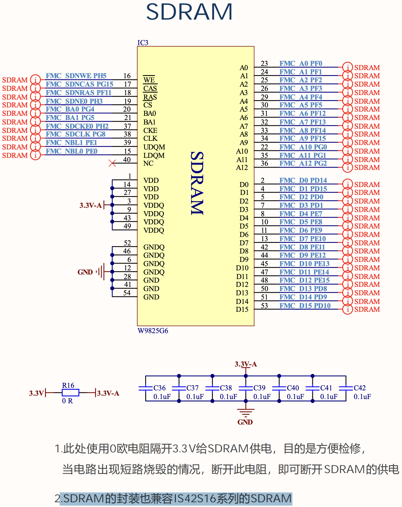

주의깊게 봐야하는 부분은 SDRAM 핀아웃을 설명하는 위 사진이다. 엄청 많은 핀들을 사용하고 있다. 하단에 W9825G6라고 되어 있지만, 추가 설명에 IS42S16과도 호환된다고 적혀있다.

> SDRAM的封装也兼容IS42S16系列的SDRAM
>
> 번역기를 돌리면, The SDRAM package is also compatible with the IS42S16 series SDRAM

따라서 CubeMX에서 FMC 페리퍼럴을 활성화할 때 위 핀아웃대로 GPIO들을 설정해주면 문제없이 SDRAM을 쓸 수 있다.

# CubeMx 설정

SDRAM을 쓰기 위해 설정해야할 곳은 FMC랑 MPU다.

## FMC 설정

### Mode

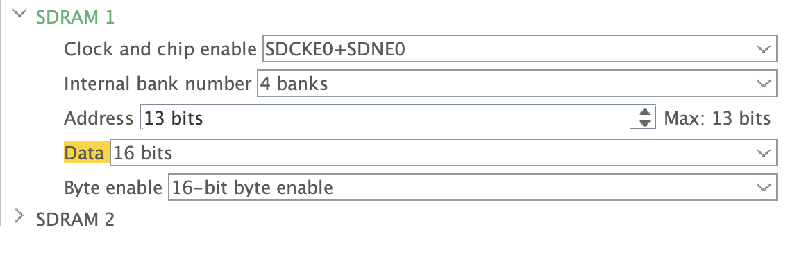

- **Clock and chip enable**

  개발보드 핀아웃을 참고하였을 때 SDRAM 1의 Bank 1을 써야 한다. FMC_SDCKE0과 FMC_SDNE0을 쓴다고 명시되어 있다. 따라서 `SDCKE0 + SDNE0`을 선택한다.

- **Internal bank number**

  IS42S16 데이터 시트에는 다음과 같이 되어 있다.

  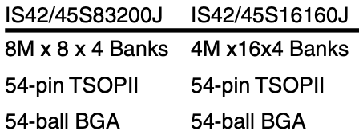

  개발 보드가 IS42S16160J를 사용하므로 램 내부적으로는 4개의 Bank가 있다. 따라서 `4 banks`를 선택한다.

- **Address, Data**

  역시 개발 보드 핀아웃을 참고하면 A0부터 A12까지 핀이 있고, D0부터 D15까지 핀이 있음을 알 수 있다. 그러므로 Address는 `13bits`를, Data는 `16bits`를 선택한다.

- **Byte enable**

  이 설정도 개발 보드 핀아웃에서 NBL0, NBL1이 있으므로 `16-bit byte enable`을 선택한다.

### Configuration

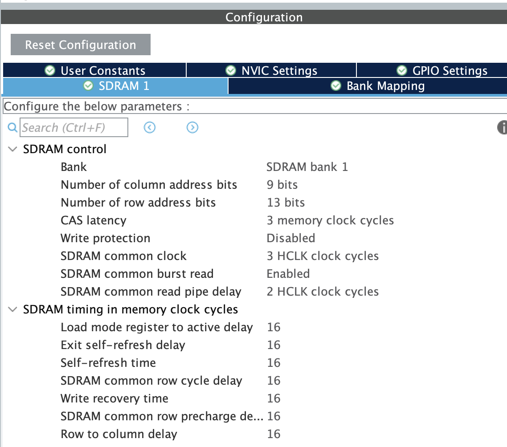

이 부분은 SDRAM의 데이터시트를 참고하여 설정한다.

- **SDRAM Control**

  - **Number of column/row address bits**

    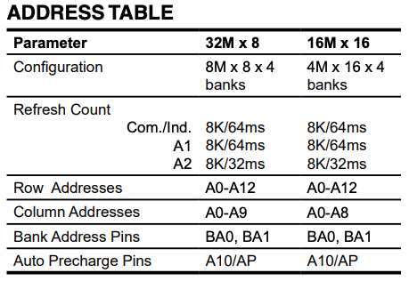

    데이터 시트에는 Column Address가 [0:8]이고 Row Address가 [0:12]이므로, 각각 `9 bits`, `13 bits`를 선택하면 된다.

  - **CAS latency**

    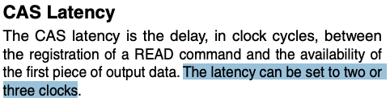

    SDRAM 데이터 시트에는 `2 memory clock cycles` 또는 `3 memory clock cycles`를 고르라고 되어있고 CubeMx에서는 1 ~ 3개의 클럭 사이클을 설정할 수 있게 되어 있다.

    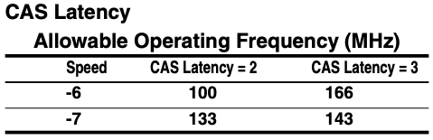

    위와 같이 SDRAM 데이터 시트에 따르면, CAS 클럭 사이클을 다르게 설정함으로 허용 가능한 동작 클럭을 변경할 수 있다. 현재 IS42S16160J-7TLI 모델을 쓰고 있으므로 Speed 열에서는 -7 행을 봐야 한다. CAS Latency에 따라 허용 가능한 동작 클럭은 133MHz, 143MHz다.

    > 여기서 말하는 허용 가능한 동작 클럭은 FMC_SDCLK 라인으로 전달되는 클럭을 의미한다.

    그러나 STM32H743 데이터시트에 따르면, FMC는 SDRAM의 허용 가능한 동작 클럭보다 더 낮은 값으로 동작하고 있음을 알 수 있다.

    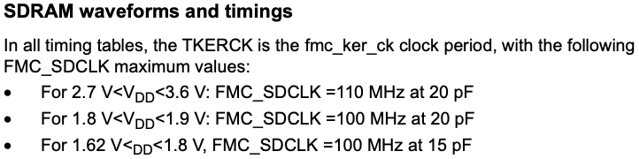

    동작 전압이 2.7V ~ 3.6V 사이라면 FMC_SDCLK는 최대 110MHz라고 한다. 따라서 어떤 값으로 설정하더라도 큰 문제는 없다.

  - **SDRAM common clock**

    SDRAM 컨트롤러 레지스터 설명에 의하면, 다음과 같다.

    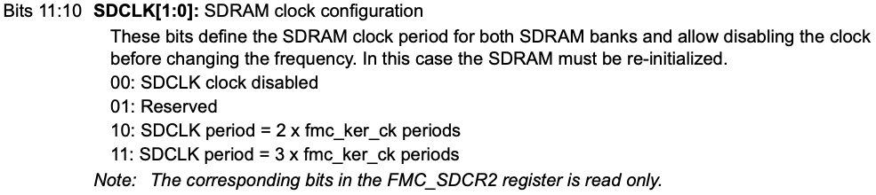

    SDCLK의 출력값을 설정한다. 이 값을 0으로 설정하면 SDCLK 값을 0으로 설정하므로 SDRAM에 클럭이 공급되지 않아 데이터를 읽고 쓸 수 없는 상태가 된다. 2 또는 3으로 설정하면, FMC로 전달되는 fmc_ker_ck값을 2또는 3으로 나누어 SDCLK값을 설정한다.

    > 데이터시트에는 주기로 나와있기 때문에, 클럭으로 생각하면 fmc_ker_ck값을 2로 나누는 것이다.

    그러므로 `Disabled`가 아닌 아무 값이나 선택하면 된다.

    그리고 이 값은 두 개의 SDRAM 뱅크가 공유한다.

  - **SDRAM common burst read**

    Burst Mode에 대해서는 다음 링크를 참조하는게 낫겠다.

    [DRAM Memory Organization - 2 : 성능 향상 전략](https://computing-jhson.tistory.com/28)

    성능 향상을 위해 Row Buffer에 복사했던 데이터를 순차적으로 가져오는 기법인데, 활성화하면 성능 향상에 도움이 된다.

  - **SDRAM common read pipe delay**

    SDRAM 컨트롤러 레지스터 설명에 의하면, 다음과 같다.

    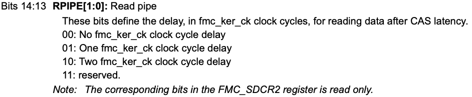

    CAS Latency 이후에 잠깐 기다리는 클럭 수를 지정하는건데, 사실 잘 모르겠다. 0으로 설정한다면 CAS Latency 이후에 바로 데이터를 읽으려 하므로 추가 지연이 없겠다.

- **SDRAM timing in memory clock cycles**

  정확한 값을 알아보기보다는 SDRAM을 테스트하는 것이 목적이어서 전부 기본값으로 두었다.

## MPU 설정

FMC를 통해 SDRAM에 접근하면 AXI 트랜잭션이 발생한다. 이 말은 내부 버스를 통해 메모리를 읽고 쓴다는 것을 의미한다.

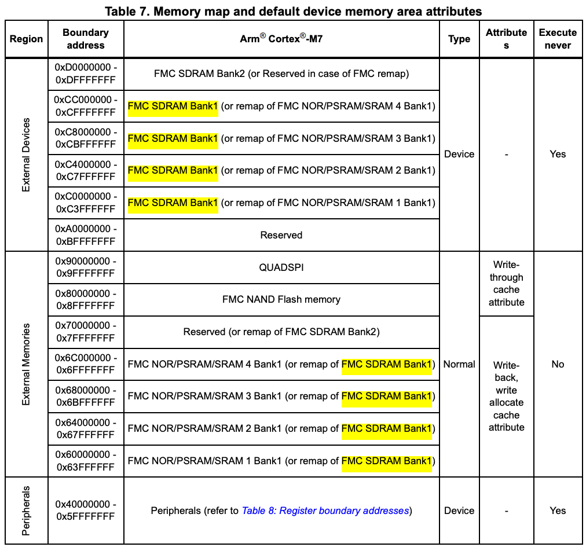

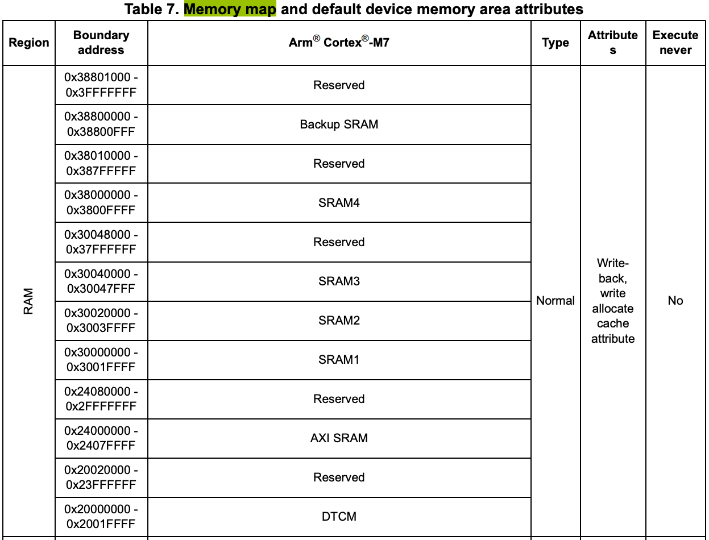

STM32H743의 메모리 맵은 위와 같다. AXI 트랜잭션이 발생하면 그 주소값은 위에 있는 메모리 맵의 특정 위치를 가리킨다. 그러나 MPU 설정을 살펴보면, SDRAM에 접근하는 트랜잭션이 막혀 있다는 것을 알 수 있다.

### SDRAM 접근이 막혀있는 이유

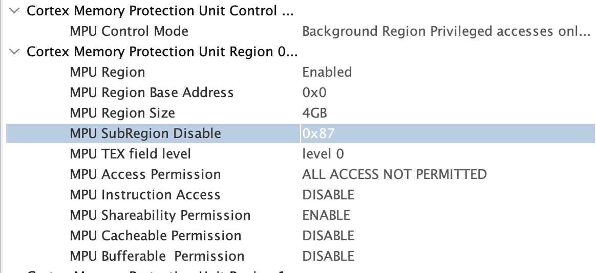

MPU는 메모리 맵에 대한 접근 및 허용 가능한 권한들을 Region 단위로 설정할 수 있도록 제공하고 있다. 더 높은 Region일수록 우선순위가 높다.

가장 낮은 *Region 0*을 살펴보면, `MPU Region Size`가 `4GB`이므로 메모리 맵 전체에 대한 설정임을 알 수 있다. 이 설정은 단순히 `MPU Access Permission`이 `ALL ACCESS NOT PERMITTED`이므로 어떠한 접근이든 막는다.

그러나 예외를 두고 있는데, `MPU SubRegion Disable`이 `0x87`이다. 이 값의 범위는 `0x00 ~ 0xFF`인데, `MPU Region Size`를 8개로 나눈 후 각각의 범위에 대해 현재 Region에서 설정한 규칙을 비활성화할지 결정할 수 있다. `0x87 = 0b10000111`이므로, `0x00000000 ~ 0x5FFFFFFF` 범위와 `0xE0000000 ~ 0xFFFFFFFF` 범위에는 접근 거부를 비활성화한다는 것을 알 수 있다. 위 메모리 맵을 다시 읽어보면 해당 영역은 MCU의 SRAM, 그리고 예약된 영역(?)임을 알 수 있다. 따라서 SDRAM Bank 1에 해당하는 주소 범위인 `0xC0000000 ~ 0xCFFFFFFFF`를 접근 가능하게 만들어야 한다.

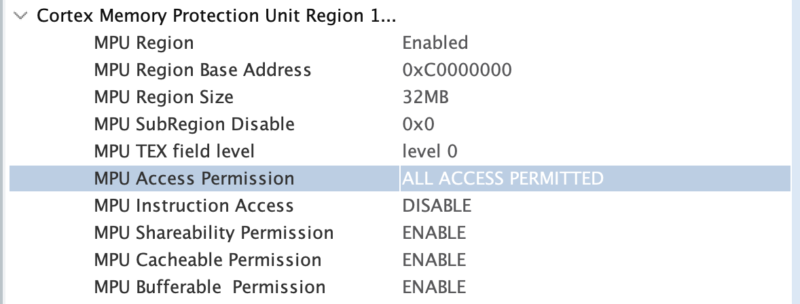

아래와 같이 Base Address를 `0xC0000000`으로 설정하고, SDRAM의 크기인 32 MB(256 Mbit)를 Region Size로 설정한다. 그 외 권한들은 모두 허용으로 설정한다.

# 코드

험난한 CubeMX설정을 마쳤으므로 바로 HAL 라이브러리 함수를 쓰면 좋겠지만, SDRAM 컨트롤러를 통해 데이터를 읽고 쓰려면 초기화 과정이 필요하다.

## SDRAM 컨트롤러 초기화

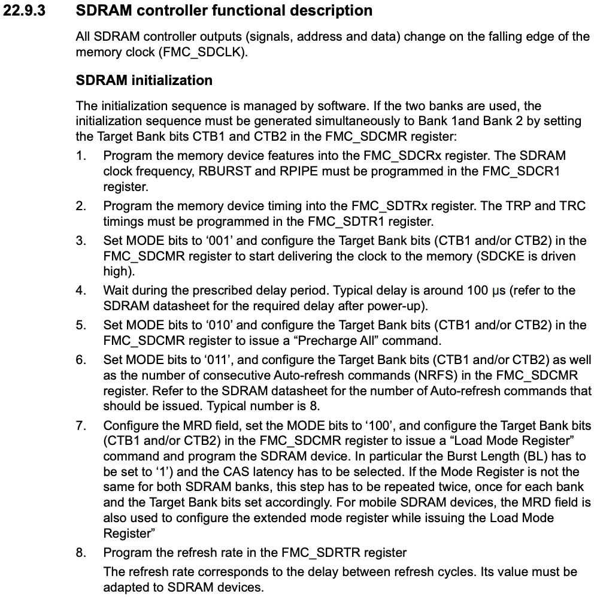

CubeMX로 코드를 생성했다면, 1, 2단계에 해당하는 코드는 이미 `stm32h7xx_ll_fmc.c`에 작성되어 있다.

```c
/**
  * @brief  Initializes the FMC_SDRAM device according to the specified
  *         control parameters in the FMC_SDRAM_InitTypeDef
  * @param  Device Pointer to SDRAM device instance
  * @param  Init Pointer to SDRAM Initialization structure
  * @retval HAL status
  */
HAL_StatusTypeDef FMC_SDRAM_Init(FMC_SDRAM_TypeDef *Device, const FMC_SDRAM_InitTypeDef *Init)
{
  /* 생략 */
}

/**
  * @brief  Initializes the FMC_SDRAM device timing according to the specified
  *         parameters in the FMC_SDRAM_TimingTypeDef
  * @param  Device Pointer to SDRAM device instance
  * @param  Timing Pointer to SDRAM Timing structure
  * @param  Bank SDRAM bank number
  * @retval HAL status
  */
HAL_StatusTypeDef FMC_SDRAM_Timing_Init(FMC_SDRAM_TypeDef *Device,
                                        const FMC_SDRAM_TimingTypeDef *Timing, uint32_t Bank)
{
  /* 생략 */
}
```

실제로 작성해야하는 코드들은 3 ~ 8단계에 해당하는 코드다. 각 단계는 SDRAM 컨트롤러에게 보낼 명령 구조체를 설정하는 것과 명령을 보낸 후 잠시 기다리는 정도라서 어렵지 않다.

```c
static HAL_SDRAM_StateTypeDef SDRAM_Init(void) {
  const uint32_t timeout = 0xFF;
  FMC_SDRAM_CommandTypeDef command = {
      .CommandTarget = FMC_SDRAM_CMD_TARGET_BANK1,
      .AutoRefreshNumber = 1,
  };

  // 1. Start Clock 명령 전송
  if (HAL_SDRAM_SendCommand(&hsdram1, &command, timeout) != HAL_OK) {
    return HAL_SDRAM_STATE_ERROR;
  }

  // 2. 명령 전송 후 100us 만큼 기다리기
  HAL_Delay(1);

  // 3. Precharge 명령 전송
  command.CommandMode = FMC_SDRAM_CMD_PALL;
  if (HAL_SDRAM_SendCommand(&hsdram1, &command, timeout)) {
    return HAL_SDRAM_STATE_ERROR;
  }

  // 4. AutoRefresh 명령 전송
  command.CommandMode = FMC_SDRAM_CMD_AUTOREFRESH_MODE;
  command.AutoRefreshNumber = 8;
  if (HAL_SDRAM_SendCommand(&hsdram1, &command, timeout) != HAL_OK) {
    return HAL_SDRAM_STATE_ERROR;
  }

  // 5. LoadMode 명령 전송
  command.CommandMode = FMC_SDRAM_CMD_LOAD_MODE;
  command.ModeRegisterDefinition = 0x30 |  // Latency Mode bitset   = 011
                                   0x0 |   // Burst Type bit        = 0
                                   0x0;    // Burst Length bitset   = 000
  if (HAL_SDRAM_SendCommand(&hsdram1, &command, timeout) != HAL_OK) {
    return HAL_SDRAM_STATE_ERROR;
  }

  // 6. RefreshRate 주기 전송
  if (HAL_SDRAM_ProgramRefreshRate(&hsdram1, FMC_SDRTR_COUNT) != HAL_OK) {
    return HAL_SDRAM_STATE_ERROR;
  }

  return HAL_SDRAM_STATE_READY;
}
```

## 읽기/쓰기

읽고 쓸 때는 `HAL_SDRAM_Write_16b`, `HAL_SDRAM_Read_16b` 함수를 쓰면 된다.

테스트 코드는 다음과 같이 짰다.

```c
  /* 생략 */

  MX_FMC_Init();
  /* USER CODE BEGIN 2 */

  if (SDRAM_Init() == HAL_SDRAM_STATE_READY) {
    // 1. Fill buffer with random values
    for (int i = 0; i < BUFFER_SIZE; i++) {
      srcBuf[i] = i * i;
    }

    // 2. Write data to SDRAM
    status =
        HAL_SDRAM_Write_16b(&hsdram1, SDRAM_DEVICE_ADDR, srcBuf, BUFFER_SIZE);
    // 3. Read data from SDRAM
    status =
        HAL_SDRAM_Read_16b(&hsdram1, SDRAM_DEVICE_ADDR, dstBuf, BUFFER_SIZE);

    // 4. Verify by comparing buffers
    for (int i = 0; i < BUFFER_SIZE; i++) {
      if (srcBuf[i] != dstBuf[i]) {
        error++;
      }
    }
  }

  /* USER CODE END 2 */

  /* 생략 */
```

잘 불러와지는 것을 확인했다. (증거 사진 추가 바람)
