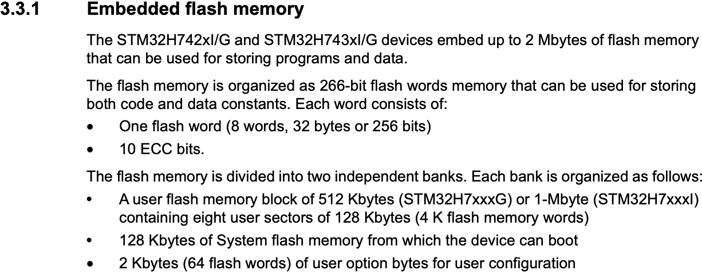
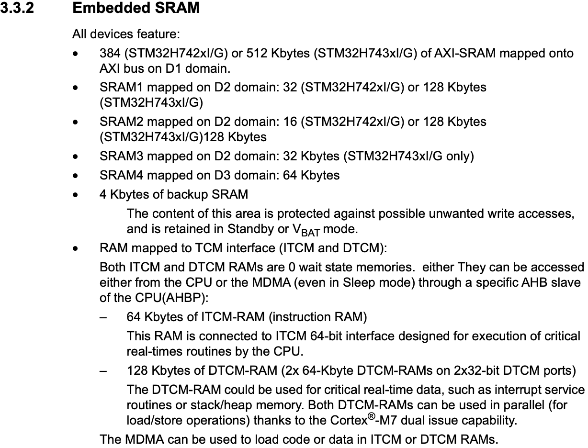
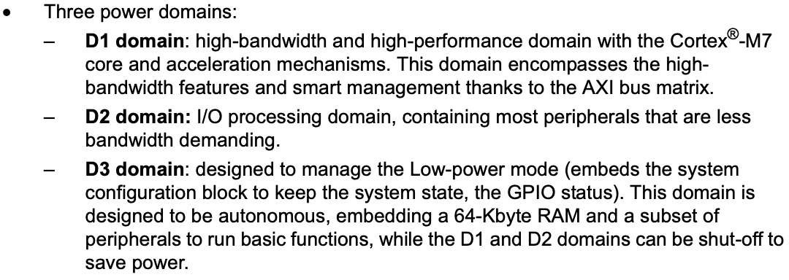
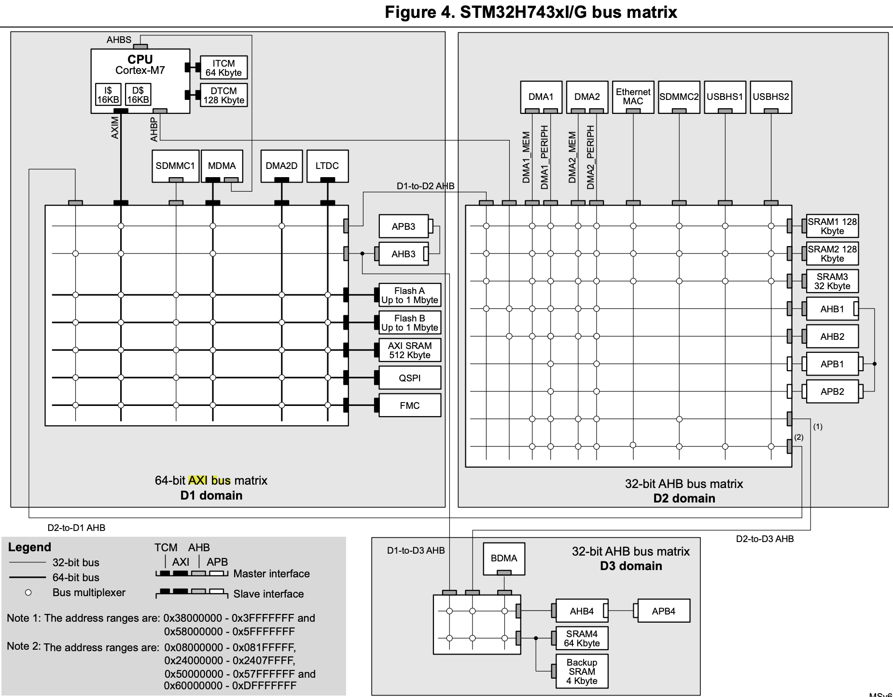
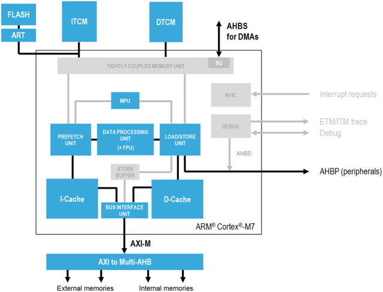
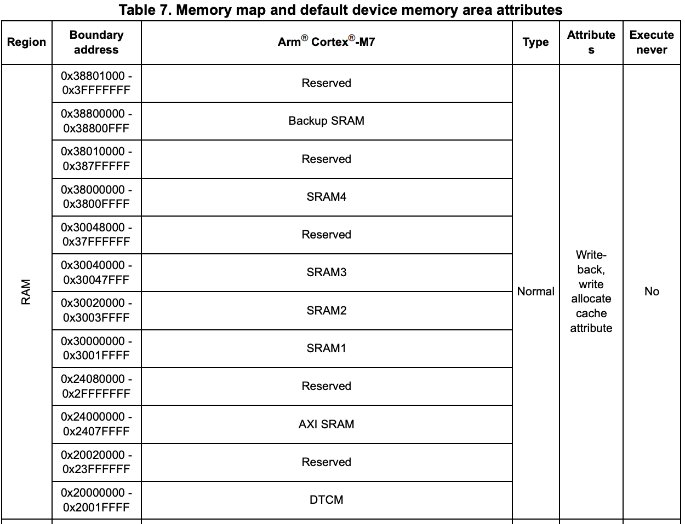

# 데이터 시트 읽기

데이터 시트에는 플래시 메모리와 SRAM 메모리에 대한 짧은 설명만 있다. H742xI/G시리즈와 H743xI/G시리즈에 대해 명시하고 있지만, 이번 글에서는 H743xI시리즈에 대해서만 서술한다.

## 플래시 메모리



STM32H7xxxI의 플래시 메모리는 두 개의 뱅크로 구성되어 있고, 각 뱅크는 1 MB의 크기를 갖는다. 뱅크에는 프로그램 코드와 데이터가 저장된다. 플래시 메모리에서 사용하는 워드 단위는 256 비트(32 바이트) + ECC 10 비트 = 266 비트다. ECC 비트는 워드 오류 검증에만 쓰이므로 실제 플래시 메모리 크기는 2 MB보다 더 크겠지만, 플래시 메모리 크기를 명시할 때 ECC 비트는 제외한 크기로 다루는 것 같다.

뱅크의 크기는 2 MB를 반으로 나눈 1 MB이다. 한 개의 뱅크는 8개의 섹터, 128 KB의 시스템 플래시 메모리, 2 KB의 사용자 설정으로 구성되어 있다. 섹터의 크기는 1 MB / 8 = 128 KB이다. 한 섹터에는 128 KB / 32 bit = 4000개의 워드가 들어있다. 

## SRAM



표로 정리하면 다음과 같다.

|타입|크기|
|---|---|
|AXI-SRAM (D1 Domain)|512 KB|
|SRAM1 (D2 Domain)|128 KB|
|SRAM2 (D2 Domain)|128 KB|
|SRAM3 (D2 Domain)|32 KB|
|SRAM4 (D3 Domain)|64 KB|
|백업 SRAM (D3 Domain)|4 KB|
|DTCM-RAM|128 KB|
|ITCM-RAM|64 KB|

### Domain

Domain이란 개념이 등장하는데, [다른 문서](https://www.st.com/resource/en/application_note/an5014-stm32h7x3-smart-power-management-expansion-package-for-stm32cube-stmicroelectronics.pdf)를 참고하면 Domain이 나뉜 이유를 알 수 있다.



- D1 Domain (64-bit AXI bus matrix) : Cortex-M7 코어와 가속 메커니즘(?)을 통해 고대역폭, 고성능을 제공하는 도메인이다. AXI 버스 매트릭스를 통해 고대역폭 기능과 스마트 관리 기능을 제공한다.
- D2 Domain (32-bit AHB bus matrix): 비교적 낮은 대역폭을 요구하는 페리퍼럴의 I/O 작업을 수행하는 도메인이다.
- D3 Domain (32-bit AHB bus matrix): 저전력을 위한 도메인이다. 저전력 모드를 실행한다면 이 도메인의 메모리에 저장된 함수들을 실행하고 D1/D2 도메인을 비활성화하게 된다.



D1 도메인에는 고대역폭, 고성능이 필요한 페리퍼럴(ex. LCD-TFT, FMC 등)을 위한 버스 매트릭스(64-bit AXI bus matrix)가 있고, D2 도메인에는 D1 도메인에 속하지는 않지만 일반적인 페리퍼럴들을 위한 버스 매트릭스(32-bit AHB bus matrix)가 있다. D3 도메인에는 저전력 모드에서 동작할 수 있는 페리퍼럴들을 위한 버스 매트릭스(32-bit AHB bus matrix)가 있다.

도메인을 나눈 이유는 트래픽을 분산시키기 위함이다. 만약, 전역 메모리를 두고 모든 페리퍼럴이 이 메모리에 접근한다고 하면 그 메모리와 연결된 버스 매트릭스에서는 많은 경합이 발생할 것이고 중재에 드는 비용이 커진다. **따라서 도메인의 목적에 맞게 페리퍼럴들을 분류하고 메모리를 쪼개서 각 도메인에 할당한다면, 가능한 한 도메인 안에서만 데이터 전송을 처리할 수 있게 된다**. 트래픽이 분산되었으므로, 버스 경합과 대기 시간을 줄일 수 있게 된다.

데이터를 CPU가 직접 읽고 처리한다면, 모든 데이터가 **SRAM -> bus matrix -> CPU -> bus matrix  -> 페리퍼럴**의 경로로 흘러간다. 여기서 DMA를 쓴다면 최초 CPU 명령 처리 이후에는 **SRAM -> bus matrix(local) -> DMA -> bus matrix(local) -> 페리퍼럴**로 이어진다. 그러므로, 데이터가 CPU까지 흐르지 않고 같은 도메인 내에서만 흐르므로 불필요한 버스 트래픽을 줄일 수 있다. (단, DMA와 SRAM이 같은 도메인에 있어야 함!)

### DTCM-RAM, ITCM-RAM

위 버스 매트릭스 사진을 보면 CPU 블럭 바로 오른쪽에 DTCM과 ITCM 메모리 블럭이 있는 것을 볼 수 있다. CPU와 메모리가 TCM으로 연결되어 있는 것도 볼 수 있는데 TCM은 **Tightly Coupled Memory**의 약자로, **ARM Cortex-M7에서 제공하는 기능이다**. CPU에 바로 부착시킨 SRAM을 TCM으로 부른다. 코어와 바로 연결된 버스를 통해 프로그램이 즉시 메모리에 접근할 수 있게 한다. **캐시와 다른 점은, 캐시는 cache-miss가 발생할 수 있어 예측 불가능이지만, TCM은 메모리에 접근하는 것이므로 예측 가능하다는 점이다**. 게다가 코어와 메모리가 바로 연결되어 있으므로 지연 시간이 전혀 없다.



ITCM은 Instruction-TCM, DTCM은 Data-TCM이다. 위 다이어그램을 보면 ITCM과 DTCM이 캐시와 연결된게 아니라 코어의 유닛과 바로 연결되어 있는 것을 알 수 있다. 

ITCM은 명령어 코드를 갖고 있는 메모리고, DTCM은 데이터를 갖고 있는 메모리다. 명령어는 플래시 메모리에서 가져오게 되지만, 명령어를 빠르게 가져와야 한다면 ITCM을 사용할 수 있다. DTCM 역시 자주 쓰는 데이터를 빠르게 접근하기 위해 쓸 수 있다. 굳이 두 메모리를 나눈 이유는 명령어 읽기와 데이터 송수신 간 발생하는 경합을 피하기 위해 *harvard 아키텍처* 설계를 차용한 것이다.

CPU가 빠르게 접근 가능한 장점이 있지만, 다른 페리퍼럴이 DTCM에 있는 데이터에 접근하려면 일반적인 DMA를 쓸 수 없고 MDMA만 쓸 수 있다.

# STM32H743VIT6 빌드 결과 분석

gcc로 프로젝트를 빌드하면 아래와 같이 빌드 결과를 출력한다. 

```txt
[build] Memory region         Used Size  Region Size  %age Used
[build]          DTCMRAM:       30080 B       128 KB     22.95%
[build]              RAM:           0 B       512 KB      0.00%
[build]           RAM_D2:           0 B       288 KB      0.00%
[build]           RAM_D3:           0 B        64 KB      0.00%
[build]          ITCMRAM:           0 B        64 KB      0.00%
[build]            FLASH:      108308 B         2 MB      5.16%
```

RAM은 AXI-SRAM을, RAM_D2는 SRAM1 + SRAM2 + SRAM3을, RAM_D3은 SRAM4를 의미한다. 위 출력은 모든 데이터를 DTCMRAM에 박아두었는데, 이는 링커 스크립트가 그렇게 하도록 설정했기 때문이다.

```ld
/* Specify the memory areas */
MEMORY
{
DTCMRAM (xrw)      : ORIGIN = 0x20000000, LENGTH = 128K
RAM (xrw)      : ORIGIN = 0x24000000, LENGTH = 512K
RAM_D2 (xrw)      : ORIGIN = 0x30000000, LENGTH = 288K
RAM_D3 (xrw)      : ORIGIN = 0x38000000, LENGTH = 64K
ITCMRAM (xrw)      : ORIGIN = 0x00000000, LENGTH = 64K
FLASH (rx)      : ORIGIN = 0x8000000, LENGTH = 2048K
}
```

링커 스크립트 초입에는 메모리 크기와 주소를 지정한다. 여기서 등장하는 주소값은 데이터시트에 있는 메모리 매핑에 따라 지정되어 있다.



```ld
SECTIONS
{
  /* ... 다른 코드 생략 ... */

  /* Initialized data sections goes into RAM, load LMA copy after code */
  .data :
  {
    /* ... 설정 코드 생략 ... */
  } >DTCMRAM AT> FLASH

 /* Initialized TLS data section */
  .tdata : ALIGN(4)
  {
    /* ... 설정 코드 생략 ... */
  } >DTCMRAM AT> FLASH

  /* Uninitialized data section */
  .tbss (NOLOAD) : ALIGN(4)
  {
    /* ... 설정 코드 생략 ... */
  } >DTCMRAM

  .bss (NOLOAD) : ALIGN(4)
  {
    /* ... 설정 코드 생략 ... */
  } >DTCMRAM

  /* User_heap_stack section, used to check that there is enough RAM left */
  ._user_heap_stack (NOLOAD) :
  {
    /* ... 설정 코드 생략 ... */
  } >DTCMRAM
}
```
그 다음, Sections 섹션(?)에서는 메모리 섹션에서 정의된 DTCMRAM에 .data, .tdadta, .tbss, .bss, ._user_heap_stack 등을 지정하고 있는 것을 볼 수 있다. 

만약 특정 SRAM에 변수를 만들고 싶다면, 미리 링커 스크립트에서 섹션 부분에 영역에 대해 명시한 후 변수 선언 시 속성을 붙여 선언하면 된다.

```ld
SECTIONS
{
  .axi_ram (NOLOAD) :
  {
      . = ALIGN(32);
      *(.axi_ram)
      *(.axi_ram*)
      . = ALIGN(32);
  } >RAM
}
```

```c
__attribute__((section(".axi_ram"), aligned(32)))
static uint8_t audio_storage[256 * 1024];
```
